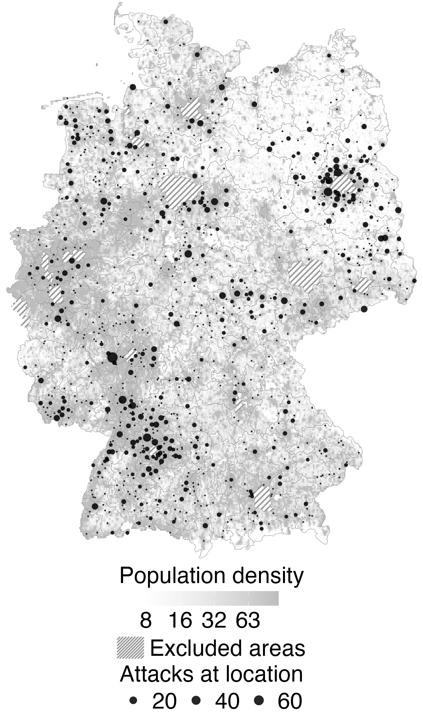
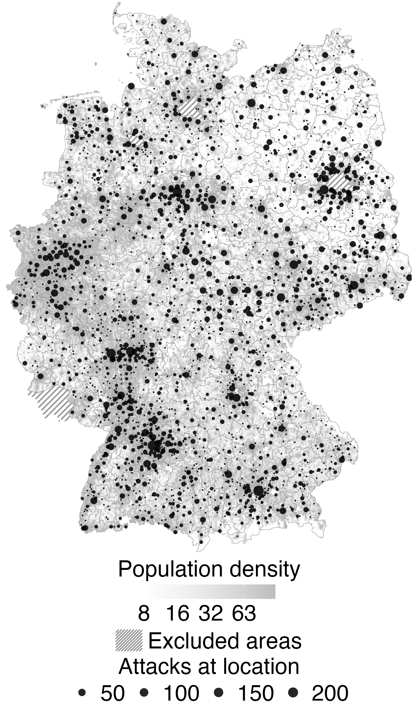
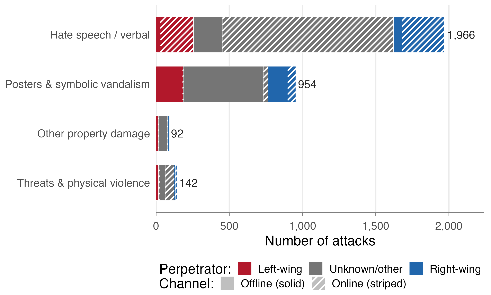
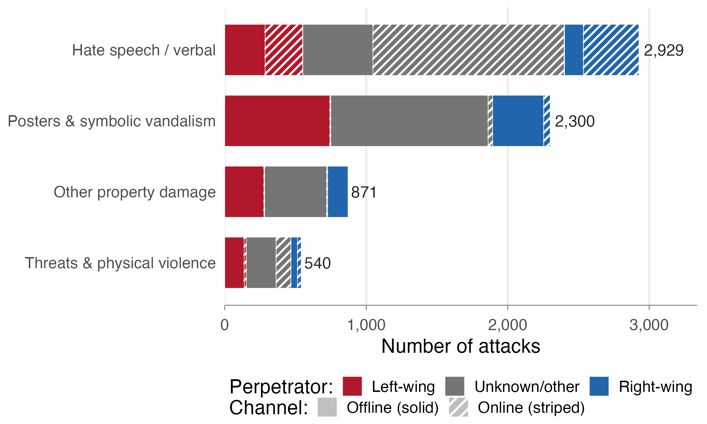
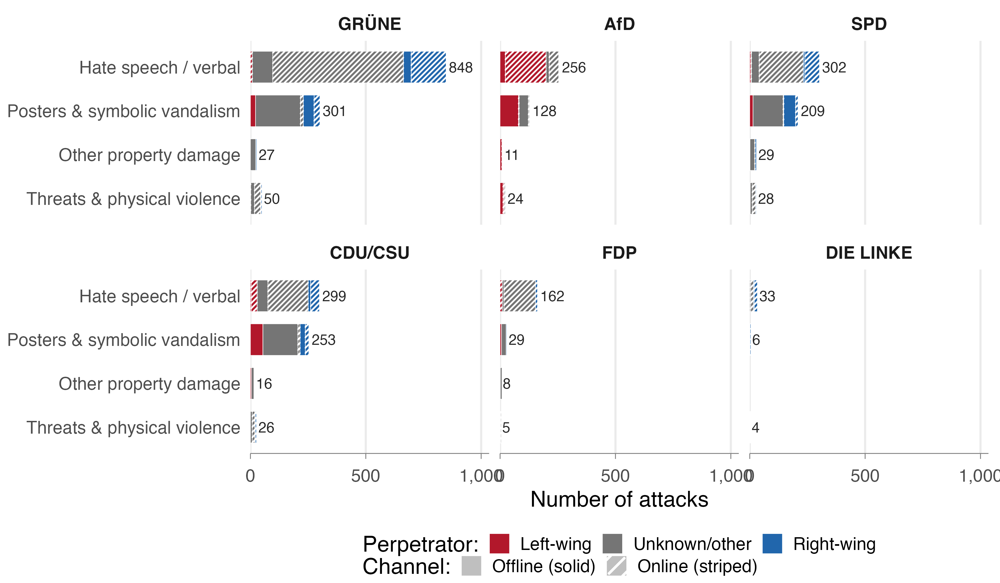
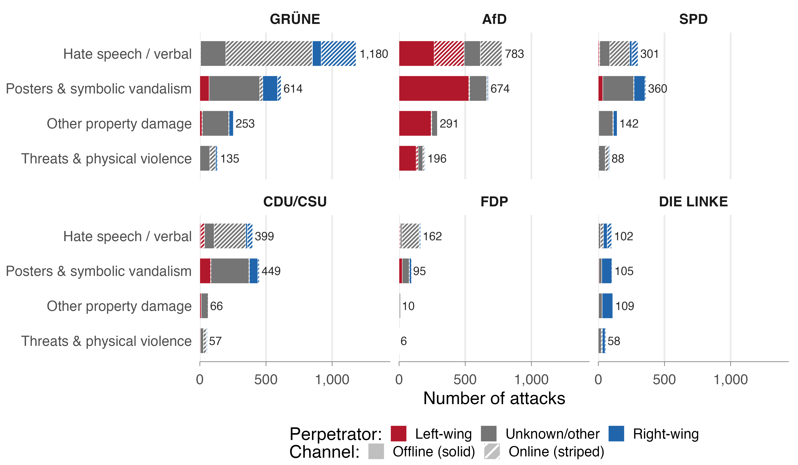
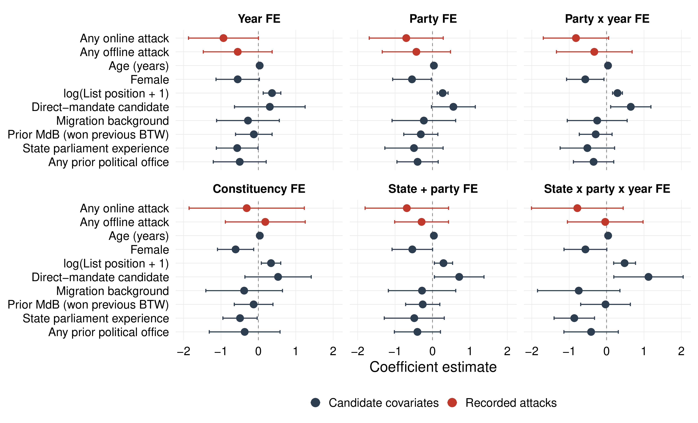
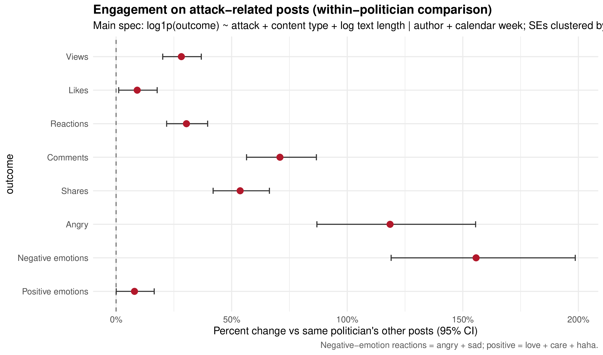
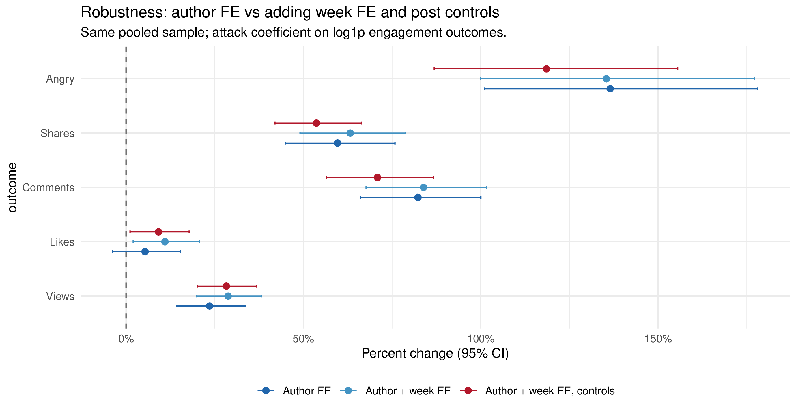
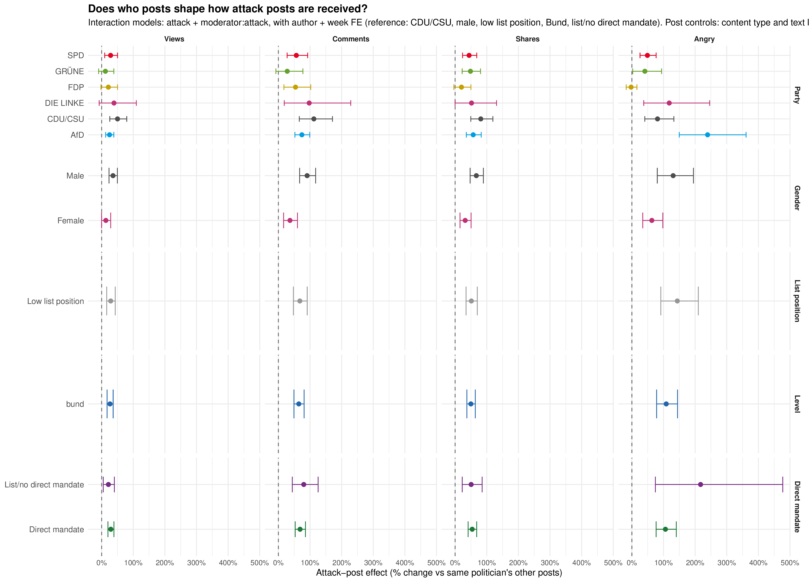

## Motivation {.smaller}

::: {.incremental}
- **Hostility toward politicians** — widely salient; GLES: **78%** online abuse, **30%** threats [@ZA7704; @ZA10102]
- Prior work on **consequences**, mostly from **self-reports** [@ponce2019violence; @haakansson2024representation; @alizade2024does]
- **Gap:** little systematic evidence on **police-recorded incidents** themselves, or on how politicians **take them up in communication**
:::

# The data {background-color="#5386b9"}

## 10,730 recorded incidents {.smaller}

:::: {.columns}

::: {.column width="55%"}
- Federal government responses to *Kleine Anfragen*: lists of police-recorded offenses against politicians and party structures
- Per incident: **date, location, targeted party, criminal offense**; for a subset a short **narrative** of what happened
:::

::: {.column width="45%"}
::: {.linked-sources}
**Linked sources**

- Candidates & MPs (n = 2,929 federal; 1,266 state)
- GLES candidate studies 2021 + 2025 (N = 1,099)
- Facebook posts (n ≈ 430,000 from 337 politicians)
:::
:::

::::

# What does recorded hostility look like? {background-color="#5386b9"}

## Mostly low-level: posters, graffiti, messages {.smaller}

::: {.appendix-links}
Appendix:
<a href="#/appendix-example-records" class="appendix-inline-link">Examples from the records</a>
:::

::: {.slide-iframe .slide-iframe-bar}
<iframe src="assets/interactive/sachverhalt_cluster_shares.html?view=overview&embed=1" loading="lazy"></iframe>
:::

## Within each target type {.smaller}

::: {.slide-iframe .slide-iframe-tall .slide-iframe-panels}
<iframe src="assets/interactive/sachverhalt_cluster_shares.html?view=panels&embed=1" loading="lazy"></iframe>
:::

##  {background-iframe="assets/interactive/attacks_map.html" background-interactive="true" data-menu-title="The live map"}

::: {.appendix-links .appendix-links-on-map}
Appendix:
<a href="#/appendix-static-maps" class="appendix-inline-link">Static maps</a>
:::

::: {.notes}
Where attacks happen. Dots = incidents over population density. Attacks broadly follow people, but eastern clusters (Berlin hinterland, Saxony, Saxony-Anhalt, Thuringia) exceed what population density would predict. Static federal/state maps are in the appendix.
:::

# Patterns in the records {background-color="#5386b9"}

## Who attacks whom {.smaller}

::: {.slide-iframe .slide-iframe-figure-heatmap}
<iframe src="assets/interactive/party_attacks_by_direction_heatmap.html?embed=1" loading="lazy"></iframe>
:::

::: {.appendix-links}
Appendix:
<a href="#/appendix-electoral-calendar" class="appendix-inline-link">Electoral calendar</a>
<a href="#/appendix-how-they-attack" class="appendix-inline-link">How they attack</a>
<a href="#/appendix-repertoires-federal" class="appendix-inline-link">Federal by party</a>
<a href="#/appendix-repertoires-state" class="appendix-inline-link">State by party</a>
:::

## Linking candidate surveys to police records

::: {.slide-iframe .slide-iframe-figure-gles}
<iframe src="assets/interactive/gles_threat_attack_correlations.html?embed=1" loading="lazy"></iframe>
:::

[GLES 2021 + 2025 × attacks (N = 1,047)]{.tiny}

::: {.appendix-links}
Appendix:
<a href="#/appendix-perceived-security" class="appendix-inline-link">Perceived security</a>
<a href="#/appendix-gles-full" class="appendix-inline-link">Full GLES specifications</a>
:::

# Attacks as a communication resource {background-color="#5386b9"}

## Who talks about attacks? {.smaller}

::: {.slide-iframe .slide-iframe-figure-wide}
<iframe src="assets/interactive/attack_post_party_posts_attacks.html?embed=1" loading="lazy"></iframe>
:::

## Does talking about attacks pay off?

::: {.slide-iframe .slide-iframe-figure-wide .slide-iframe-figure-engagement}
<iframe src="assets/interactive/attack_post_engagement_by_party.html?embed=1" loading="lazy"></iframe>
:::

[Within-politician estimates: percent change in engagement on attack-related posts vs. the same politician's other posts (author + week FE; pooled reference in diamonds)]{.tiny}

::: {.appendix-links}
Appendix:
<a href="#/appendix-engagement-pooled" class="appendix-inline-link">Pooled estimates</a>
<a href="#/appendix-engagement-robustness" class="appendix-inline-link">Robustness</a>
<a href="#/appendix-engagement-heterogeneity" class="appendix-inline-link">Heterogeneity</a>
:::

## Takeaways {.smaller}

::: {.incremental}
1. **10,730 attacks** linked to politicians, surveys, and posts
2. **Low-level, thinly spread** — campaign-driven, ideological
3. **Weak link** between survey and police data
4. **Uneven politicization** — payoff in **attention**
:::

## Thank you {.center}

**Cornelius Erfort** &middot; [cornelius.erfort@uni-wh.de](mailto:cornelius.erfort@uni-wh.de)

**Elias Koch** &middot; [e.koch@hertie-school.org](mailto:e.koch@hertie-school.org)

## References {.references-slide .smaller visibility="uncounted"}

::: {#refs}
:::

# Appendix {background-color="#5386b9" visibility="uncounted"}

## Examples from the records {#appendix-example-records visibility="uncounted"}

::: {.example-records-slide}
::: {.example-quotes}
::: {.example-quote}
::: {.example-head}
[29.03.2022]{.example-date}

[Gera]{.example-location}
:::

[Property damage · Party premises · The Left · Offline]{.example-spec}

Unknown perpetrators threw a stone at the shop window of the Die Linke constituency office and damaged the outer pane.
:::

::: {.example-quote}
::: {.example-head}
[27.02.2023]{.example-date}

[Leipzig]{.example-location}
:::

[Threat · Party premises · FDP · Mail]{.example-spec}

The FDP district office received a postcard by mail. Text: *"If your war comes here, we'll kill you. Period."*
:::

::: {.example-quote}
::: {.example-head}
[12.06.2024]{.example-date}

[Lüchow]{.example-location}
:::

[Insult · Party premises · SPD · In person]{.example-spec}

The accused entered an SPD MP's office and insulted a staff member with the words "idiot", "pig" and a homophobic slur; the insults were also directed at the openly gay MP.
:::
:::

[Source: parliamentary inquiries (*Kleine Anfragen*).]{.tiny}
:::

## Where attacks happen (static maps) {#appendix-static-maps visibility="uncounted"}

:::: {.columns}

::: {.column width="50%"}
{height="620"}

[Federal targets (n = 1,968)]{.tiny}
:::

::: {.column width="50%"}
{height="620"}

[All targets (n = 7,874)]{.tiny}
:::

::::

## Attacks track the electoral calendar {#appendix-electoral-calendar visibility="uncounted" .smaller}

:::: {.columns}

::: {.column width="50%"}

Federal

::: {.slide-iframe .slide-iframe-figure-col}
<iframe src="assets/interactive/attacks_timeseries_bund.html?embed=1" loading="lazy"></iframe>
:::

[targets; dashed lines = federal elections]{.tiny}
:::

::: {.column width="50%"}

State

::: {.slide-iframe .slide-iframe-figure-col}
<iframe src="assets/interactive/attacks_timeseries_landtag.html?embed=1" loading="lazy"></iframe>
:::

[sample; grey bars = covered legislative periods]{.tiny}
:::

::::

## How they attack {#appendix-how-they-attack visibility="uncounted"}

:::: {.columns}

::: {.column width="50%"}

Federal

:::

::: {.column width="50%"}

State

:::

::::

Verbal/online hate speech dominates; threats & physical violence are rare -- **left- and right-wing perpetrators use similar repertoires**

## Repertoires by party (federal) {#appendix-repertoires-federal visibility="uncounted"}

{height="640" fig-align="center"}

## Repertoires by party (state) {#appendix-repertoires-state visibility="uncounted"}

{height="640" fig-align="center"}

## Perceived security and recorded attacks {#appendix-perceived-security visibility="uncounted" .smaller}

::: {.slide-iframe .slide-iframe-figure-wide .slide-iframe-figure-coef-panels}
<iframe src="assets/interactive/coefplot_perceived_security_panels_bin_attacks_by_spec.html?embed=1" loading="lazy"></iframe>
:::

:::: {.columns .coef-panel-captions}

::: {.column width="50%"}
[(a) Federal targets, 6 months pre-election]{.tiny}
:::

::: {.column width="50%"}
[(b) All targets through GLES field end]{.tiny}
:::

::::

## GLES: full specifications (federal, 6 months pre-election) {#appendix-gles-full visibility="uncounted"}

{height="620" fig-align="center"}

## Engagement payoff: pooled within-politician estimates {#appendix-engagement-pooled visibility="uncounted"}

{height="600" fig-align="center"}

## Engagement payoff: robustness across specifications {#appendix-engagement-robustness visibility="uncounted"}

{height="600" fig-align="center"}

## Engagement payoff: heterogeneity {#appendix-engagement-heterogeneity visibility="uncounted"}

{height="600" fig-align="center"}
